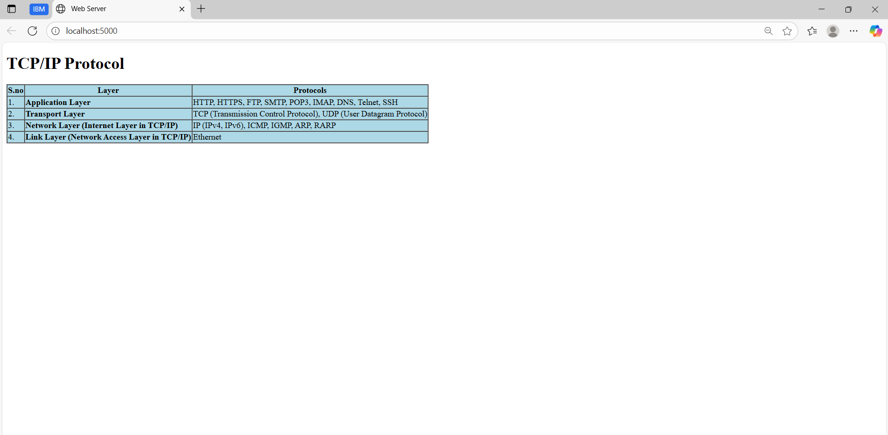

-# EX01 Developing a Simple Webserver
## Date:01-09-2025

## AIM:
To develop a simple webserver to serve html pages and display the list of protocols in TCP/IP Protocol Suite.

## DESIGN STEPS:
### Step 1: 
HTML content creation.

### Step 2:
Design of webserver workflow.

### Step 3:
Implementation using Python code.

### Step 4:
Import the necessary modules.

### Step 5:
Define a custom request handler.

### Step 6:
Start an HTTP server on a specific port.

### Step 7:
Run the Python script to serve web pages.

### Step 8:
Serve the HTML pages.

### Step 9:
Start the server script and check for errors.

### Step 10:
Open a browser and navigate to http://127.0.0.1:8000 (or the assigned port).

## PROGRAM:
```python 
from http.server import HTTPServer, BaseHTTPRequestHandler
content = '''
<!doctype html>
<html>
<head>
<title>Web Server</title>
</head>
<body>
<h1>TCP/IP Protocol</h1>

<table border="1" align="left cellpadding="10" cellspacing="0" bgcolor="lightblue">
  <tr>
    <th>S.no</th>
    <th>Layer</th>
    <th>Protocols</th>
  </tr>

  <tr>
    <td>1.</td>
    <td><b>Application Layer</b></td>
    <td>HTTP, HTTPS, FTP, SMTP, POP3, IMAP, DNS, Telnet, SSH</td>
  </tr>

  <tr>
    <td>2.</td>
    <td><b>Transport Layer</b></td>
    <td>TCP (Transmission Control Protocol), UDP (User Datagram Protocol)</td>
  </tr>

  <tr>
    <td>3.</td>
    <td><b>Network Layer (Internet Layer in TCP/IP)</b></td>
    <td>IP (IPv4, IPv6), ICMP, IGMP, ARP, RARP</td>
  </tr>

  <tr>
    <td>4.</td>
    <td><b>Link Layer (Network Access Layer in TCP/IP)</b></td>
    <td>Ethernet</td>
  </tr>
</table>

</body>
</html>
'''
class MyServer(BaseHTTPRequestHandler):
    def do_GET(self):
        print("GET request received...")
        self.send_response(200)
        self.send_header("Content-type", "text/html")
        self.end_headers()
        self.wfile.write(content.encode("utf-8"))

print("This is my webserver, running at http://localhost:5000/")
server_address = ('', 5000)
httpd = HTTPServer(server_address, MyServer)
httpd.serve_forever()
```


## OUTPUT:




## RESULT:
The program for implementing simple webserver is executed successfully.
